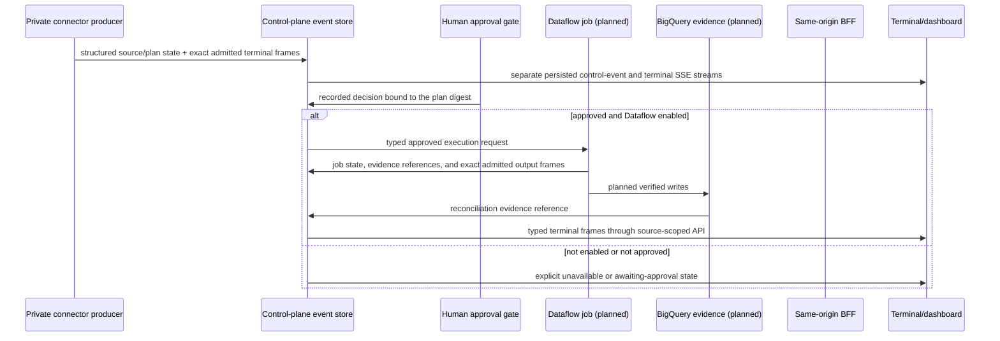

# Planned Dataflow and terminal producer stream

## Current status

Dataflow is **not enabled** in the recorded inventory. There are no current
Dataflow jobs and no migration BigQuery datasets. Consequently, there is no
production Dataflow terminal producer to demonstrate today.

The terminal transport is implemented. The M3 verifier publishes its observed
source, edge-protection, and compiler identifiers and counters; the M4 runner
publishes the exact Dataflow job and verified BigQuery result identifiers it
receives when cloud execution is enabled. The Dataflow execution itself remains
planned until the project prerequisites above are explicitly enabled.

## Producer rules

Each producer emits two deliberately separate records:

1. structured control state for counters, stages, results, and evidence; and
2. a typed `TerminalFrame` containing one exact producer-admitted command,
   stdout, stderr, system, or metric line.

The browser never parses terminal text to derive control state. A terminal
frame identifies its run, source, lane, stream, producer, tool, timestamp,
sequence, severity, and evidence references. The line is retained exactly or
the complete frame is suppressed before persistence; the server does not
rewrite it and the UI does not embellish it. Producers must suppress raw
credentials, access tokens, private reasoning, and unapproved records before
admission.

The event store remains the source of truth for dashboard counters and
activity. The bounded terminal store is the source of truth for the mirror.
If no persisted frame exists, the terminal must show an absent or pending
state rather than generated output or a progress animation.

## Planned Dataflow gate

Before a Dataflow launch can be called a verified execution, all of the
following must be present and linked:

1. an approved exact plan digest;
2. a deployed, reviewed template and typed parameters;
3. a real Dataflow job identifier and terminal state;
4. a target dataset/table created for that run; and
5. reconciliation evidence from the destination.

Until then, the correct terminal label is **planned** or **not configured**.
The API-discovery command is in [INVENTORY.md](INVENTORY.md); enabling Dataflow
is an owner-approved change described in [SETUP.md](SETUP.md).
