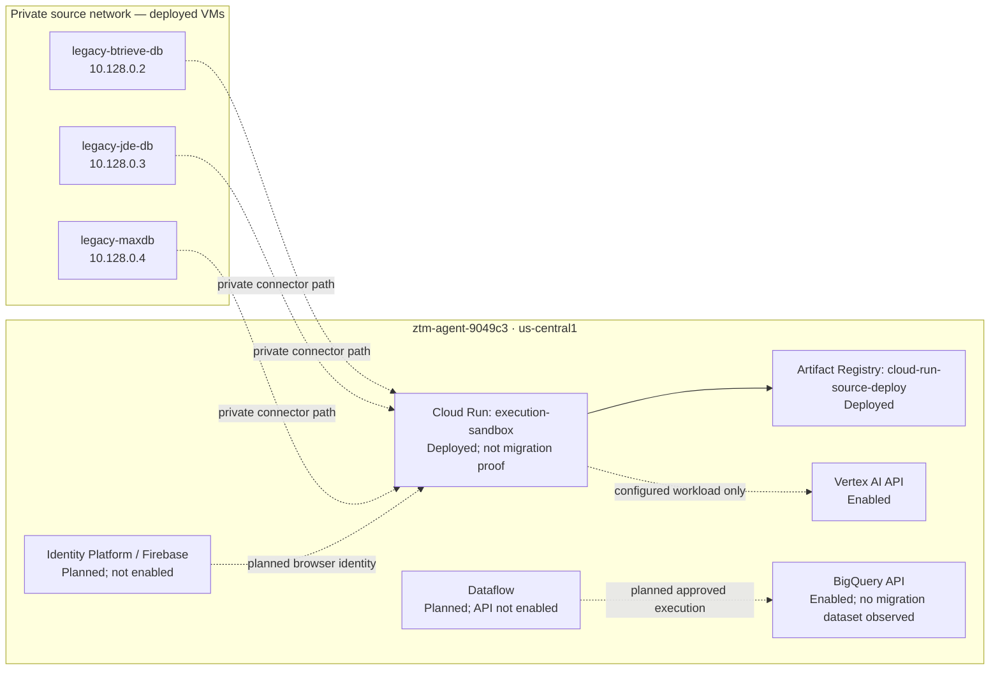

# Cloud architecture and judge guide

This directory is the tracked, canonical description of the current Google
Cloud inventory and the planned migration runtime. It separates things that
were observed in project `ztm-agent-9049c3` from things the repository is
designed to create later. It is not deployment evidence for a planned service.

The combined authenticated web deployment is specified in
[HOSTED_DRAFT.md](HOSTED_DRAFT.md). Its code and runbook are ready, but it
remains planned until the named Cloud Run, Firebase, and storage resources are
created and verified.

## Current inventory at a glance

| Item | Status | Observed or intended detail |
| --- | --- | --- |
| Project | **Deployed** | `ztm-agent-9049c3` |
| Region / zone | **Deployed** | `us-central1` / `us-central1-a` |
| Legacy source VMs | **Deployed, private** | `legacy-btrieve-db` (`10.128.0.2`), `legacy-jde-db` (`10.128.0.3`), and `legacy-maxdb` (`10.128.0.4`) |
| Cloud Run | **Deployed** | `execution-sandbox`; it is not evidence that a trusted migration executed |
| Artifact Registry | **Deployed** | `cloud-run-source-deploy` |
| Enabled APIs | **Deployed** | Vertex AI, BigQuery, Cloud Run, Artifact Registry |
| Identity Platform / Firebase | **Planned** | Not enabled at the recorded inventory point |
| Dataflow | **Planned** | Not enabled at the recorded inventory point; no Dataflow jobs exist |
| Migration BigQuery data | **Planned** | No migration datasets exist at the recorded inventory point |
| M6 Cloud SQL authority canary | **Deployed, constrained** | `keraun-m6-pg`: PostgreSQL 16, private IP only, CMEK, zonal `db-f1-micro`; empty `m3_authority` database |
| M6 sanitized outbox transport | **Deployed, constrained** | Pub/Sub topic/subscription/DLQ plus an empty BigQuery audit table; no relay or migration writer deployed |

The active Google account is deliberately redacted from every tracked document.
Run the discovery commands locally to see the authenticated account; never paste
it, OAuth tokens, service-account JSON, or command output containing secrets
into an issue, a terminal recording, or this repository.

## Read in this order

1. [Inventory and verification](INVENTORY.md) records the known resources and
   repeatable discovery commands.
2. [Setup](SETUP.md) distinguishes safe discovery from owner-approved changes.
3. [Security boundaries](SECURITY.md) explains private-source, credential, and
   public-replay rules.
4. [Planned Dataflow and terminal stream](DATAFLOW_TERMINAL_STREAM.md) shows
   the intended producer-to-dashboard path without claiming a running job.
5. [Judge experience](JUDGES.md) makes the hosted exact replay primary and the
   local connector lab optional.
6. [M6 cloud readiness](M6_CLOUD_READINESS.md) validates the non-secret
   desired state and owner-approval boundary for Cloud SQL, Pub/Sub, BigQuery,
   KMS, VPC Service Controls, and Model Armor without provisioning any of them.

## Architecture map

Solid boxes are inventory facts. Dashed arrows and any node marked **Planned**
are design intent, not a claim that the connection or workload exists.
