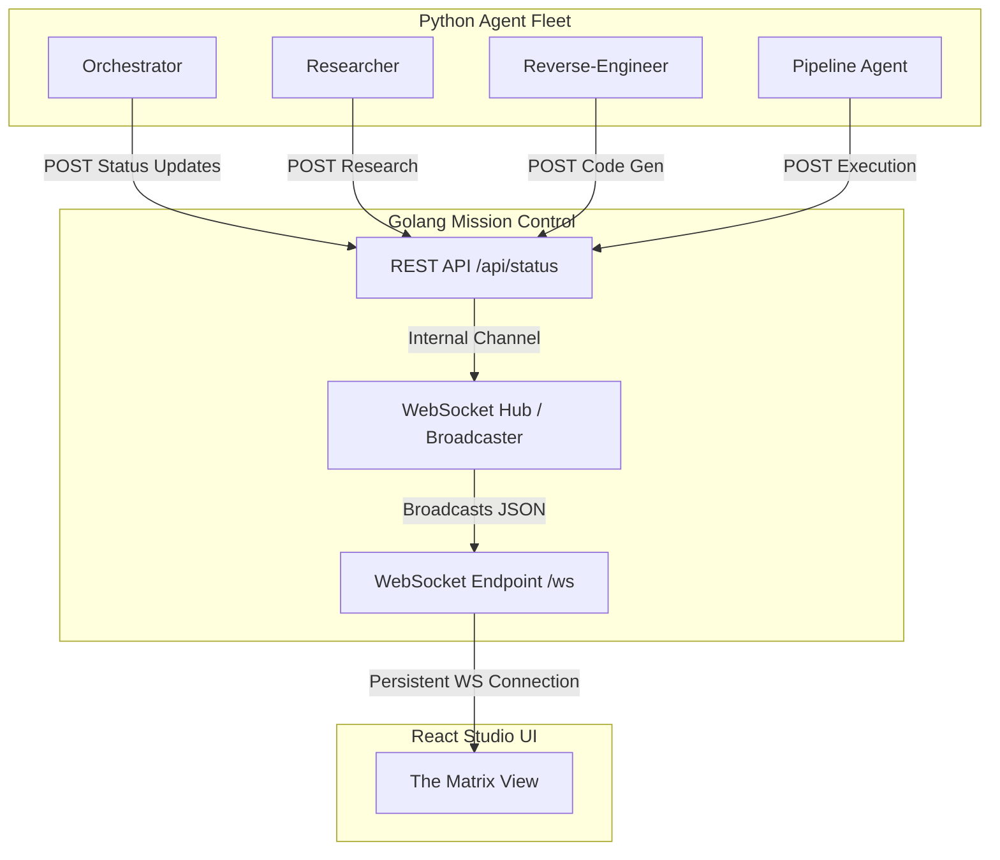

# Golang Mission Control Architecture

## Overview
The Mission Control backend acts as the critical high-throughput conduit between the Python-based AI Agent Fleet (Zero-Trust Migration Agents) and the React/Vite Studio UI ("The Matrix View").

## Architecture Diagram

## Why Golang over FastAPI?
While Python's FastAPI is excellent for standard REST APIs and supports WebSockets, this specific use case demands extreme concurrency and low memory overhead:

1. **High-Frequency Streaming**: The AI agents generate a massive volume of token-by-token thought processes, tool execution logs, and hex-dump parsing events.
2. **Goroutines vs Asyncio**: Golang's native goroutines provide a highly efficient, preemptively scheduled concurrency model. A Go WebSocket server can handle tens of thousands of concurrent connections (or very high-throughput single connections) with a fraction of the memory footprint of Python's `asyncio` event loop.
3. **Microservice Separation**: By decoupling the UI state management from the heavy AI processing loops, we ensure the UI remains perfectly responsive even if the Python AI Orchestrator is blocking on a synchronous LLM call or heavy regex/EBCDIC decoding.

## Implementation Details
- **Framework**: Standard library `net/http` combined with `github.com/gorilla/websocket` for rock-solid WebSocket handling.
- **REST Endpoint**: A simple `POST /api/status` route accepts JSON payloads from `main.py` containing agent name, status, and message.
- **Broadcaster Hub**: A central Go `chan` (channel) receives incoming REST payloads and fans them out to all connected WebSocket clients, ensuring the Studio UI updates in real time.
