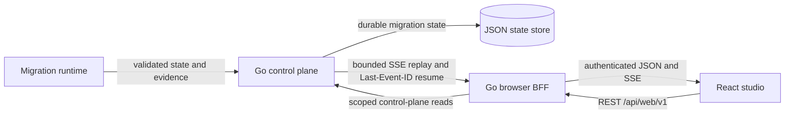

# Go Mission Control architecture

## Purpose

Mission Control is the trusted browser-facing control plane between the migration runtime and the React studio. It exposes bounded REST resources and authenticated Server-Sent Events (SSE); it does not expose agent chain-of-thought, raw secrets, or an unbounded process log.

## Request and event flow

The control-plane API is mounted at `/api/v1/migrations`. The browser uses the separate `/api/web/v1` BFF surface. Live run events are streamed from `/api/web/v1/runs/{run_id}/events`; reconnecting clients resume with a validated `Last-Event-ID` cursor.

## Design properties

- **Durable truth:** snapshots and persisted events drive the UI. The browser does not infer missing migration state.
- **Bounded replay:** each SSE response is capped, ends cleanly, and can be resumed from the last processed event.
- **Typed vocabulary:** event types, run identifiers, source identifiers, and evidence references are validated before admission.
- **Server-side authorization:** the BFF scopes live runs, approvals, cloud setup, and demo publication to the authenticated principal.
- **Safe observability:** summaries and evidence references are emitted. Private reasoning, credentials, and raw unapproved data are not browser payloads.
- **Responsive separation:** the Go service remains independent of synchronous model and data-processing work in the migration runtime.

## Implementation

- Go standard-library `net/http` handlers serve REST and SSE.
- `studio-backend/control_plane.go` implements the migration control plane and durable event replay.
- `studio-backend/web_bff.go` and `studio-backend/web_runs.go` implement the authenticated browser contract.
- `contracts/web/v1/openapi.json` is the canonical web API contract used by generated Go and TypeScript types.
- The React client uses `fetch` for SSE so it can send authorization and `Last-Event-ID` headers explicitly.

The live terminal mirror is a separate, typed, bounded stream. It carries exact producer-admitted command/stdout/stderr lines after secrets are suppressed at the producer; it is not a WebSocket substitute for application state and never carries hidden model reasoning.
