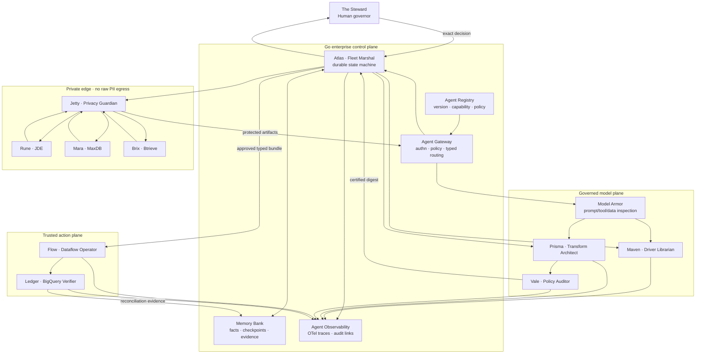

# Sparky fortified enterprise agent fleet

## Decision

Sparky targets the **Fortified Enterprise Fleet** category. The migration is a
long-running institutional workflow with three heterogeneous source systems,
private data boundaries, specialized tools, one digest-bound human decision,
trusted cloud execution, and independently verified destination evidence. That
complexity warrants a multi-agent system rather than a single agent with a
large prompt.

The official challenge requires a scalable catalog of agents, durable
cross-session operation, production-data governance, identity and gateway
controls, inline model protection, and OpenTelemetry-compatible observability.
It also scores intelligent delegation, strict separation of concerns, recovery
from looping or hallucinating workers, and visible proof of action. See the
[official challenge](https://allthingsagentichackathon.devpost.com/#prizes) and
[binding rules](https://allthingsagentichackathon.devpost.com/rules).

## Fleet story

The personas below are product roles, not claims that every role is an LLM.
Deterministic agents remain deterministic; Gemini is invoked only where model
judgment is useful. Every agent receives a typed task envelope, a scoped
identity, an allowlisted tool set, a deadline, and an evidence obligation.

| Persona | Institutional role | Concrete implementation boundary | Permitted authority | Required result |
| --- | --- | --- | --- | --- |
| **Atlas — Fleet Marshal** | Owns the portfolio goal and delegates bounded work | Go control plane, orchestrator bridge, durable web state, SSE | Create tasks, advance valid state, cancel/timeout workers; cannot approve or execute transforms | Portfolio state, task graph, event/evidence links |
| **Jetty — Privacy Guardian** | Guards the private edge | Jetson, Tailscale transport, deterministic redactor, local Gemma review | Read approved source fixtures and emit protected artifacts; no BigQuery or Vertex credentials | Source manifest, protected batch, redaction evidence |
| **Rune — JDE Archivist** | Decodes EBCDIC and packed decimal | `edge_runtime/adapters/jde.py` | Decode JDE bytes under a fixed schema; no network or planning | Typed source profile plus source digest |
| **Mara — MaxDB Cartographer** | Maps MaxDB catalogs and records | `edge_runtime/adapters/maxdb.py` | Decode the supported export format; no execution authority | Typed source profile plus source digest |
| **Brix — Btrieve Archaeologist** | Reconstructs Btrieve pages and records | `edge_runtime/adapters/btrieve.py` | Parse allowlisted page layouts; fail closed on malformed structure | Typed source profile plus source digest |
| **Maven — Driver Librarian** | Researches and fingerprints approved connectivity drivers | Go async driver research, Vertex Gemini, Artifact Registry remote | Query official sources and fingerprint one approved artifact; never execute the JAR | Candidate set, provenance, immutable fingerprint |
| **Prisma — Transform Architect** | Designs declarative migration plans | Gemini plan compiler on Vertex AI | Propose closed-schema operations only; cannot emit code or launch jobs | Schema-valid plan and exact digest |
| **Vale — Policy Auditor** | Challenges plans and blocks unsafe narrowing or leakage | Deterministic validators and policy gates | Reject or certify; cannot repair by silently widening authority | Validation report with machine-checkable reasons |
| **The Steward — Human Governor** | Makes the irreversible portfolio decision | Mission Control approval boundary | Approve or reject one exact portfolio digest | Identity-bound decision record |
| **Flow — Execution Operator** | Materializes the approved plan | Pre-registered Apache Beam/Dataflow template | Launch typed, allowlisted transforms only after approval | Dataflow job IDs, terminal states, bundle evidence |
| **Ledger — Reconciliation Controller** | Proves the destination matches the governed input | BigQuery gateway and reconciliation code | Read declared results and write audit proof; cannot alter the plan | Row counts, output digests, table and audit evidence |

## Runtime topology



## Enterprise platform mapping

| Enterprise capability | Current foundation | Hardened fleet target |
| --- | --- | --- |
| Agent Registry | Source-controlled role and policy definitions; closed generated contracts | Signed versioned agent manifests with capability discovery and promotion lifecycle |
| Agent Runtime | Go portfolio state machine, asynchronous driver research, Python edge/cloud composition | Durable task leases, heartbeats, cancellation, bounded retry budgets, dead-letter handling |
| Memory Bank | Atomic Go snapshots, immutable artifacts, event log, terminal frames | Tenant-scoped long-term facts and checkpoints with retention and provenance; never raw PII or private reasoning |
| Agent Identity | Firebase-verified owner identity and distinct API/orchestrator tokens | Per-agent workload identity and short-lived delegated credentials bound to task and tool |
| Agent Gateway | Same-origin Go BFF, owner scoping, closed request contracts | One typed inter-agent ingress with policy decisions, budgets, rate limits, and route audit |
| Model Armor | Deterministic input/output validation and credential/reasoning suppression | Inline prompt-injection, tool-poisoning, sensitive-data, and unsafe-output screening around every model call |
| Agent Observability | Durable events, exact terminal frames, evidence digests | OpenTelemetry trace spanning delegation, model/tool calls, approval, Dataflow, BigQuery, retries, and cost |

## Task envelope and memory contract

Every dispatch should carry these fields and no ambient authority:

```text
taskId, runId, portfolioDigest, agentId, agentVersion,
inputArtifactDigests[], allowedTools[], deadline, retryBudget,
dataClass, tenantId, traceId, expectedOutputSchema
```

Memory contains claims that can be verified: schemas, digests, decisions,
checkpoints, tool results, failure codes, and evidence references. It excludes
raw protected rows, bearer credentials, model chain-of-thought, and prose that
cannot be traced to an observation.

## Failure and recovery semantics

| Failure | Fleet response |
| --- | --- |
| Worker exceeds deadline or stops heartbeating | Revoke lease, record timeout, retry within the task budget, then dead-letter visibly |
| Model returns malformed or hallucinated output | Reject at the closed schema/evidence gate; bounded repair attempt with the same authority |
| Agent attempts an undeclared tool | Gateway denies before invocation and records a policy event |
| Source agent fails | Isolate the lane; Atlas cannot seal the portfolio or request approval |
| Approval digest differs | Reject without launch; create no substitute approval |
| Duplicate dispatch or network retry | Idempotency key returns the prior result; create-once artifacts remain authoritative |
| Dataflow succeeds but reconciliation fails | Mark verification failed, retain job evidence, and prevent completion/publication |
| Trace or evidence link is missing | Treat the success claim as unproven and block public demo publication |

## Implementation order

1. Promote the existing agent roles into versioned registry manifests.
2. Introduce the typed task envelope, agent lease, heartbeat, and retry budget in
   the Go control plane.
3. Wrap each model/tool boundary with gateway policy and Model Armor evidence.
4. Persist only verified cross-session facts through the Memory Bank adapter.
5. Propagate one OpenTelemetry trace ID through edge, Vertex, approval,
   Dataflow, BigQuery, and the UI.
6. Run and record one uninterrupted three-source portfolio with visible
   delegation, one human decision, recovery behavior, and reconciliation.

This sequence prioritizes the official scoring order: autonomous operational
utility first, architectural discipline second, and undeniable production
proof third.
