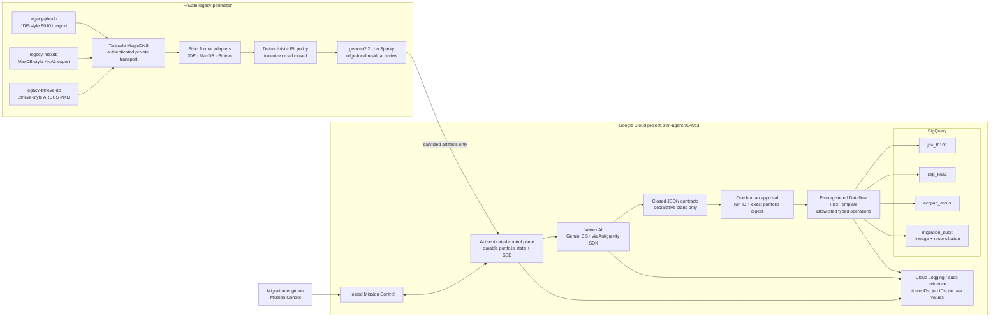

# All Things Agentic Submission Plan

Status: **draft; submission evidence is not yet complete**

Deadline: **August 31, 2026 at 5:00 PM PDT**
Category: **Fortified Enterprise Fleet**

This is the canonical plan for the Devpost submission, architecture image,
hosted judge experience, and four-minute video. A claim is not complete merely
because code exists: it must have durable evidence and be visible in the
submission.

Official references:

- [Rules](https://allthingsagentichackathon.devpost.com/rules)
- [Submission FAQ](https://allthingsagentichackathon.devpost.com/details/faqs)

Product direction and truthful factory/run boundaries are maintained in
[Plugin Factory North-Star Handoff](PLUGIN_FACTORY_NORTH_STAR_HANDOFF.md).
Use that document when implementing the preloaded demonstrations, Mission
Control run experience, A2A Agent Cards, and portable Agent Plugin package.

## Corrected eligibility and stack answers

| Submission question | Answer | Evidence or remaining action |
| --- | --- | --- |
| New project built during the submission period | **Yes** | First repository commit: August 23, 2026. Do not imply any project code existed before the event unless later audit finds otherwise. |
| Gemini 3.5 or newer | **Pending live proof** | The architecture and code target Gemini 3.5 Flash or newer. Check this only after an actual Vertex AI invocation records the deployed model name and trace/log evidence. A fallback to Gemini 2.5 does not meet the requirement. |
| Google agent framework | **Yes in source; deployment proof pending** | Python package `google-antigravity==0.1.14` is pinned and imported by the runtime planner. Antigravity CLI 1.1.19 is build tooling, not the product SDK answer. |
| Google Cloud infrastructure | **Yes, with final proof pending** | Compute Engine hosts the three private source VMs. The final video must additionally prove the hosted backend and final Vertex/Dataflow/BigQuery services that actually ran. Never list a planned service as deployed. |
| One category selected | **Yes** | Use the exact label **Fortified Enterprise Fleet**. |
| Team invitations | **Not applicable: solo entrant** | Katie is the only Devpost teammate. Codex, Claude, Gemini, and Gemma are tools/agents, not eligible human teammates. Disclose build assistance in the write-up; keep the video focused on the product-runtime fleet. |

## Truthful source description

The demo uses three live private Google Compute Engine VMs reached through
Tailscale MagicDNS. The VMs hold synthetic/deidentified binary fixtures that
exercise distinct legacy formats:

- JDE-style `F0101` EBCDIC/COMP-3 export on `legacy-jde-db`
- SAP MaxDB-style clustered `KNA1` export on `legacy-maxdb`
- Accpac/Btrieve-style `ARCUS` MKD pages on `legacy-btrieve-db`

Do not describe these as licensed production JDE, SAP, or Accpac databases.
Do not say the project “circumvents” licensing or application controls. The
safe value proposition is that authorized owners can migrate exported legacy
data without purchasing three permanent middleware paths, while retaining a
governed approval and audit trail.

## P0 submission gate

The submission is not ready until every item below is checked.

- [ ] Gemini 3.5+ executes through Vertex AI and the exact model/trace evidence is retained.
- [ ] One real run fans out across all three VM sources and keeps all lanes visible.
- [ ] The control plane persists state durably across process/restart boundaries.
- [ ] One exact portfolio digest reaches `awaiting_approval`; stale approval is rejected.
- [ ] The approved trusted template writes all three outputs to BigQuery.
- [ ] Input, accepted, rejected, and BigQuery row counts reconcile per source.
- [ ] Mission Control uses backend events only; no random/timer-driven success remains.
- [ ] A hosted judge URL works from the MacBook Air on a clean browser profile.
- [ ] The judge experience cannot expose Tailscale, raw fixtures, credentials, or unbounded billable actions.
- [ ] Google Cloud proof is captured: hosted URL, Vertex trace/log, execution job ID, BigQuery query/table, and audit/reconciliation row.
- [ ] Public repository is frozen with reproducible local and cloud setup instructions.
- [ ] Architecture Mermaid is rendered to a high-resolution PNG/SVG and uploaded to Devpost.
- [ ] Public YouTube or Vimeo video is under four minutes, in English, and unchanged through judging.
- [ ] Submission copy, data-source disclosure, third-party disclosure, testing instructions, and all URLs are complete.
- [ ] A fresh secret scan passes; the previously pasted Google API key is rotated.
- [ ] A final incognito review confirms that every public link works without the owner's session.

## Hosted judge experience

The ideal submission URL is a hosted Mission Control dashboard, not a request
that judges install the entire private edge environment. Provide:

1. A public or credentialed web UI served from Google Cloud.
2. A safe, bounded demonstration run or durable completed-run view containing
   only sanitized evidence.
3. A visible indication when private edge sources are offline; never fabricate
   live connectivity.
4. Read-only evidence access by default. Any live launch control must be
   authenticated, rate-limited, and capped so a judge cannot create unlimited
   cloud costs.
5. Exact credentials and steps in Devpost testing instructions if login is
   required. Do not put production credentials in Git or the video.

The MacBook Air test is useful only as a clean-client acceptance test. It does
not replace hosting or reproducible spin-up instructions.

## Architecture diagram draft

This diagram is the factual basis for the final Lucid drawing. Solid paths are
the target demo path; do not render a component as deployed until its gate
evidence exists.



### Diagram review checklist

- [ ] Mark raw data as private-edge-only.
- [ ] Show all three migrations as peers, not a single generic database.
- [ ] Name Gemini 3.5+, Antigravity SDK, Gemma, and the Google Cloud services.
- [ ] Show deterministic/schema gates separately from model judgment.
- [ ] Show the single digest-bound human approval before execution.
- [ ] Show that the LLM never emits or executes code.
- [ ] Show audit/reconciliation and failure paths.
- [ ] Remove vendor logos unless their use and licensing are confirmed.

## Four-minute video strategy

Use **YouTube Public** as the primary host. “Unlisted” does not qualify for the
separate public-content bonus and creates avoidable ambiguity. Vimeo Public is
an acceptable fallback. Keep the published video and URL unchanged until
winners are announced.

The official judging criterion asks for an **unedited, live execution**.
Therefore, ignore the generic checklist advice to assemble the core demo from
jump cuts. Record one continuous screen capture. It is acceptable to trim
dead air before/after the take; do not splice the execution. If the organizer
has explicitly approved uniform speed-up, apply it to the entire run and show
an on-screen speed label.

### Recording preflight

- [ ] Target 3:45-3:55 with a hard stop before 4:00.
- [ ] Start authenticated with Mission Control and evidence tabs already open.
- [ ] Use a clean browser profile at 1440x900; verify legibility at 1280x720.
- [ ] Hide bookmarks, notifications, terminal history, account email, tokens, project billing, and raw values.
- [ ] Preflight all three MagicDNS hosts, Vertex model access, Dataflow template, BigQuery targets, and the approval identity.
- [ ] Clear prior demo state using a safe test-only run ID; do not delete evidence needed for submission.
- [ ] Prepare one backup continuous take, but publish only the strongest factual take.
- [ ] Add accurate English narration or English subtitles.
- [ ] Keep third-party build-tool brands/logos out of the hero story; disclose them in text instead.

## Timed video script

### 0:00-0:12 — Show the result immediately

**Screen:** Mission Control already open. All three source lanes are visible and
the portfolio run starts immediately.

**Voiceover:**

> Three legacy exports are migrating in parallel right now—JDE, SAP MaxDB, and
> Accpac/Btrieve—without raw PII leaving the private edge or an LLM executing
> code.

**Must be visible:** three MagicDNS hostnames, a real run ID, and live—not
timer-generated—state changes.

### 0:12-0:42 — Establish the friction and “unlikely hero”

**Screen:** Keep all three lanes visible; open the compact infrastructure rail.

**Voiceover:**

> The unlikely hero is the migration engineer maintaining decades-old ERP
> exports and costly middleware. Each source has a different binary format,
> but one portfolio now inventories and governs all three through a single
> workflow.

**Must be visible:** JDE EBCDIC/COMP-3, MaxDB clustered KNA1, and Btrieve MKD
format labels; Tailscale connectivity; synthetic/deidentified-data label.

### 0:42-1:25 — Prove the zero-trust edge

**Screen:** Expand one evidence drawer while all lanes continue. Show byte and
record counts, deterministic protection, and the edge-local Gemma result.

**Voiceover:**

> Strict, code-owned adapters decode each format on the private side.
> Deterministic policy tokenizes classified fields first, then Gemma runs
> locally on Sparky as a residual privacy reviewer. Only closed, sanitized
> artifacts cross into Google Cloud; any uncertainty blocks the portfolio.

**Must be visible:** redaction status, Gemma model/location, zero residual
findings, and evidence digests—never decoded values, tokens, or raw hex.

### 1:25-2:05 — Make Gemini load-bearing

**Screen:** Plans become ready in each lane. Open the plan summary and show the
Vertex/Antigravity evidence reference.

**Voiceover:**

> Gemini 3.5 on Vertex AI, through Antigravity SDK 0.1.14, plans the three
> migrations from sanitized contracts. Code—not the model—owns IDs, targets,
> digests, and schema validation. Gemini may choose only declarative rename,
> cast, and drop operations; executable output is rejected before approval.

**Must be visible:** exact Gemini model, Vertex trace/log reference, three plan
digests, schema-valid status, and distinct source-to-table targets.

### 2:05-2:35 — Prove governance

**Screen:** The portfolio stops at `awaiting_approval`. Show the single digest,
then approve once.

**Voiceover:**

> Execution cannot start early. One human decision binds this run to the exact
> immutable digest of all three plans. A missing source, failed privacy check,
> or stale digest is non-overridable.

**Must be visible:** approval disabled before all plans are ready, run ID,
portfolio digest, approver/time, and transition to `approved` only after the
click.

### 2:35-3:12 — Prove real action and BigQuery outcome

**Screen:** Show trusted execution, real job IDs, then the three BigQuery lanes
reaching verified/completed.

**Voiceover:**

> The approved document is interpreted by a pre-registered Dataflow template;
> there is no eval, shell, or generated-code path. The run finishes in three
> BigQuery tables, and the audit row reconciles source, accepted, rejected, and
> destination counts with checksums.

**Must be visible:** trusted template version, Dataflow job ID or equivalent
real execution identifier, all three table names, counts/digests, and a green
reconciliation result.

### 3:12-3:32 — Show undeniable Google Cloud proof

**Screen:** Without stopping the recording, switch to prepared Google Cloud
Console tabs or the hosted `.run` URL. Show project `ztm-agent-9049c3`, the
Vertex log/trace, execution job, and BigQuery query result.

**Voiceover:**

> This is not a simulated dashboard. Here is the hosted Google Cloud backend,
> the Vertex invocation, the execution job, and the matching BigQuery audit
> record for the run you just watched.

**Must be visible:** project ID, timestamps/run ID that match the UI, and no
credentials or billing details.

### 3:32-3:43 — Show the agentic-forward build method

**Screen:** Show a compact, pre-opened view of
`AGENT_EXECUTION_PROTOCOL.md` and the milestone gate/test matrix. Use plain
text, not third-party logos:

```text
Build-time fleet: Codex implementation/integration · Claude security/API · Gemini architecture/planning/review
Guardrails: isolated branches · non-overlapping files · cross-provider review · tests before integration
Product runtime: Gemini + Gemma on Google Cloud
```

**Voiceover:**

> We built it agentically too: bounded agents worked in isolated branches,
> cross-reviewed each other, and only test-passing changes reached integration.
> Gemini and Gemma power the runtime.

This is build provenance, not a claim that software agents are human Devpost
teammates. Keep the wording factual and avoid logos or sponsorship language.

### 3:43-3:53 — Close on value

**Screen:** Return to the completed three-lane Mission Control view with the
architecture thumbnail or final reconciliation summary.

**Voiceover:**

> One governed fleet, three legacy migrations, one approval, and verifiable
> warehouse results—without permanent middleware or unbounded agent execution.

End immediately. The build-fleet beat is capped at eleven seconds; do not turn
it into introductions or a recitation of the full technology list.

## Submission copy and repository work

- [ ] Replace the README's “upload a dummy hex file” instructions with the real three-source run and judge-safe hosted path.
- [ ] Update `ARCHITECTURE.md`; it currently describes model-generated Beam code and arbitrary Cloud Run execution, which contradicts the implemented trusted declarative design.
- [ ] Update stale “current gaps” in `JUDGING_TRACEABILITY.md` only when new evidence actually closes them.
- [ ] Add local setup, hosted deployment, teardown, and expected-output instructions that work from a clean machine.
- [ ] Add a sanitized evidence index linking run IDs to Vertex, execution, BigQuery, approval, and reconciliation proof.
- [ ] Add `LICENSE` and a third-party dependency/license disclosure after an automated and manual license audit.
- [ ] State that project code was created during the submission period and that AI coding assistants were used for bounded implementation/review.
- [ ] Disclose synthetic fixture provenance and trademark ownership; do not imply vendor endorsement.
- [ ] Add screenshots at 1440x900 and 1280x720 plus the rendered architecture diagram.
- [ ] Verify the repository visibility. If private, invite `testing@devpost.com` and `cloudhackathons@google.com` before the deadline.

### Direct dependencies to disclose/audit

- Python: Antigravity SDK, `jsonschema`, `python-dotenv`, `requests`, and test/runtime transitive licenses.
- Go: standard-library `net/http` REST handlers and bounded SSE for the active
  browser transport. `github.com/gorilla/websocket` remains a legacy source
  dependency outside the mounted route graph; disclose it during the final
  license audit and remove it only in a separately verified cleanup. Do not
  describe `/ws` or `/api/status` as active judge-facing endpoints.
- Frontend: React, HeroUI, Motion, Vite, TypeScript, Tailwind CSS, PostCSS, Autoprefixer, and Oxlint.
- Runtime/infrastructure: Tailscale, Ollama/Gemma, Docker/nginx, Apache Beam/Dataflow if retained, and Google Cloud services/SDKs.

“No pre-existing code” is not the same as “no third-party code.” The current
answer should be: no known pre-event project code, subject to final Git audit;
the project does use open-source libraries, container images, cloud services,
AI coding assistants, and synthetic fixtures, all of which must be disclosed
and used under their applicable terms.

## Prize and bonus decisions

### Startup Excellence

Opt in only if the submission is genuinely on behalf of an already
incorporated organization and a corporate-domain email can be provided. If
not, do not select it. A solo submission remains eligible for the
Individual/Hobbyist prize and the core Fortified Enterprise Fleet prize.

### Bonus priority

1. **Gemma integration (+0.2):** already meaningful and load-bearing; retain
   live edge-local evidence.
2. **Public technical write-up (+0.2):** publish after the factual demo is
   frozen. State that it was created for entering this hackathon.
3. **LinkedIn/X post (+0.2):** include `#AllThingsAgenticHackathon` exactly.
4. **Veo:** deliberately excluded. Exact typed terminal frames and immutable
   recorded-run evidence are core product behavior; generated video would make
   that proof less direct, not more useful.

Core completion outranks bonus model stuffing.

## Final freeze

- [ ] Submit before August 31, 2026 at 5:00 PM PDT; target an internal deadline at least six hours earlier.
- [ ] Save a PDF/screenshot of the final Devpost fields and all public URLs.
- [ ] Tag the exact submitted Git commit and record artifact digests.
- [ ] Do not alter the submitted video, repository branch, hosted app, or linked content during judging.
- [ ] Fork a separate post-submission branch if development must continue.
- [ ] Monitor the submission email daily; potential winners may have a short response window.
